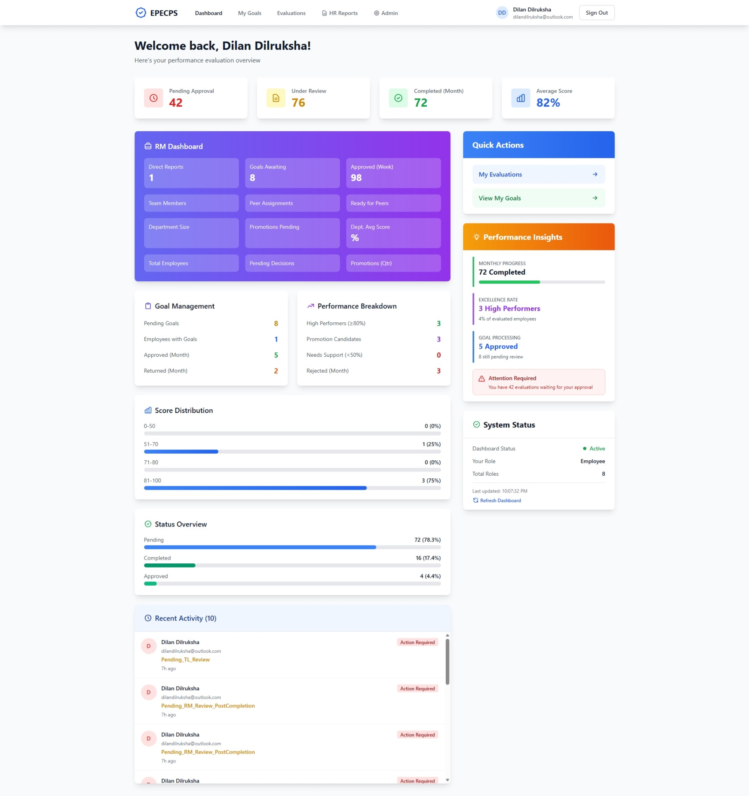

# EPECPS - Employee Performance Evaluation and Career Progression System

[](https://dotnet.microsoft.com/)
[](https://angular.io/)
[](https://www.typescriptlang.org/)
[](https://www.microsoft.com/sql-server)
[](https://azure.microsoft.com/services/active-directory/)
[](https://tailwindcss.com/)
[](LICENSE)

A comprehensive employee performance evaluation system built with .NET 8 and Angular 20, featuring Azure AD authentication, goal tracking, multi-level reviews, and reporting capabilities.



## Table of Contents

- [Overview](#overview)
- [Features](#features)
- [Technology Stack](#technology-stack)
- [Prerequisites](#prerequisites)
- [Project Structure](#project-structure)
- [Getting Started](#getting-started)
  - [1. Clone the Repository](#1-clone-the-repository)
  - [2. Backend Setup](#2-backend-setup)
  - [3. Frontend Setup](#3-frontend-setup)
  - [4. Azure AD Configuration](#4-azure-ad-configuration)
  - [5. Database Setup](#5-database-setup)
  - [6. Email Configuration](#6-email-configuration)
- [Running the Application](#running-the-application)
- [Run with Docker](#run-with-docker)
- [Database Migrations](#database-migrations)
- [Configuration Guide](#configuration-guide)
- [API Documentation](#api-documentation)
- [Troubleshooting](#troubleshooting)
- [Contributing](#contributing)
- [License](#license)

## Overview

EPECPS is an enterprise-grade performance evaluation system that streamlines the employee review process with features like goal setting, peer reviews, multi-level approvals, and comprehensive reporting. The system integrates with Microsoft Azure AD for secure authentication and authorization.

## Features

### Core Functionality
- **Goal Management**: Set, track, and evaluate employee goals with weighted scoring
- **Multi-Level Reviews**: Support for Self, Peer, Team Lead, and Reporting Manager reviews
- **Approval Workflows**: Structured approval process with HOD and GM levels
- **Dashboard & Analytics**: Real-time statistics and performance insights
- **Email Notifications**: Automated notifications for workflow events
- **Comprehensive Reporting**: Excel export with advanced filtering capabilities
- **Azure AD Integration**: Enterprise-grade authentication and role-based access control

### Advanced Features
- Score templates with customizable categories and items
- Personal goal tracking with activities and evidence
- Promotion case management
- Training recommendations
- Audit logging and approval history
- Document management for evaluations

## Technology Stack

### Backend
- **Framework**: .NET 8
- **Database**: SQL Server (Entity Framework Core 9.0)
- **Authentication**: Microsoft Identity Web (Azure AD)
- **ORM**: Entity Framework Core
- **API Documentation**: Swagger/OpenAPI
- **Reporting**: EPPlus (Excel generation)
- **Logging**: Serilog

### Frontend
- **Framework**: Angular 20.3
- **Authentication**: @azure/msal-angular 4.0
- **Styling**: Tailwind CSS 3.4
- **Language**: TypeScript 5.9
- **Build Tool**: Angular CLI

## Prerequisites

Before you begin, ensure you have the following installed:

### Required Software
- **Node.js**: v18 or higher ([Download](https://nodejs.org/))
- **npm**: v9 or higher (comes with Node.js)
- **Angular CLI**: v20 or higher
  ```bash
  npm install -g @angular/cli
  ```
- **.NET SDK**: 8.0 or higher ([Download](https://dotnet.microsoft.com/download))
- **SQL Server**: 2019 or higher (LocalDB, Express, or full version)
  - [SQL Server Express](https://www.microsoft.com/en-us/sql-server/sql-server-downloads)
  - LocalDB is included with Visual Studio
- **Visual Studio 2022** (recommended) or **VS Code**
- **Git**: For version control

### Azure Requirements
- **Azure AD Tenant**: For authentication and authorization
- **App Registrations**: Two app registrations (API and SPA) in Azure AD
- Access to Azure Portal with sufficient permissions

## Project Structure

```
epecps/
??? backend/
?   ??? Epecps.Api/              # ASP.NET Core Web API
?   ?   ??? Controllers/         # API Controllers
?   ?   ??? Program.cs           # Application entry point
?   ?   ??? appsettings.json     # Configuration file
?   ??? Epecps.Application/      # Application layer (DTOs, Interfaces)
?   ?   ??? DTOs/                # Data Transfer Objects
?   ?   ??? Interfaces/          # Service interfaces
?   ??? Epecps.Domain/           # Domain layer (Entities)
?   ?   ??? Entities/            # Domain models
?   ??? Epecps.Infrastructure/   # Infrastructure layer (Data, Services)
?       ??? Persistence/         # EF Core DbContext
?       ??? Migrations/          # Database migrations
?       ??? Services/            # Business logic services
??? frontend/
    ??? epecps-web/              # Angular application
        ??? src/
        ?   ??? app/             # Application components
        ?   ?   ??? core/        # Core modules (auth, guards)
        ?   ?   ??? services/    # API services
        ?   ?   ??? models/      # TypeScript models
        ?   ?   ??? employee/    # Employee feature module
        ?   ?   ??? pages/       # Page components
        ?   ??? environments/    # Environment configurations
        ??? package.json         # npm dependencies
```

## Getting Started

### 1. Clone the Repository

```bash
git clone https://github.com/dilrukshax/epecps.git
cd epecps
```

### 2. Backend Setup

#### Install Dependencies

Navigate to the API project directory:

```bash
cd backend/Epecps.Api
```

Restore NuGet packages:

```bash
dotnet restore
```

#### Configure Database Connection

Edit `backend/Epecps.Api/appsettings.json`:

```json
{
  "ConnectionStrings": {
    "DefaultConnection": "Server=(localdb)\\mssqllocaldb;Database=EpecpsDb;Trusted_Connection=True;MultipleActiveResultSets=true"
  }
}
```

**Connection String Options:**

**For LocalDB (Development):**
```json
"Server=(localdb)\\mssqllocaldb;Database=EpecpsDb;Trusted_Connection=True;MultipleActiveResultSets=true"
```

**For SQL Server Express:**
```json
"Server=localhost\\SQLEXPRESS;Database=EpecpsDb;Trusted_Connection=True;MultipleActiveResultSets=true;TrustServerCertificate=True"
```

**For SQL Server with Authentication:**
```json
"Server=your-server;Database=EpecpsDb;User Id=your-username;Password=your-password;MultipleActiveResultSets=true;TrustServerCertificate=True"
```

**For Azure SQL Database:**
```json
"Server=tcp:your-server.database.windows.net,1433;Database=EpecpsDb;User Id=your-username;Password=your-password;Encrypt=True;TrustServerCertificate=False;Connection Timeout=30;"
```

### 3. Frontend Setup

Navigate to the frontend directory:

```bash
cd ../../frontend/epecps-web
```

Install npm packages:

```bash
npm install
```

#### Configure API URL

Edit `frontend/epecps-web/src/environments/environment.ts`:

```typescript
export const environment = {
  production: false,
  apiUrl: 'https://localhost:7275' // Your backend API URL
};
```

### 4. Azure AD Configuration

You need to create two app registrations in Azure AD: one for the API and one for the SPA (frontend).

#### Step 1: Create API App Registration

1. Go to [Azure Portal](https://portal.azure.com)
2. Navigate to **Azure Active Directory** > **App registrations** > **New registration**
3. Configure:
   - **Name**: `EPECPS API`
   - **Supported account types**: Single tenant
   - **Redirect URI**: Leave empty for now
4. Click **Register**
5. Note down:
   - **Application (client) ID**
   - **Directory (tenant) ID**

#### Step 2: Expose API (API App Registration)

1. In the API app registration, go to **Expose an API**
2. Click **Set** next to Application ID URI
3. Accept the default URI: `api://{client-id}` or use custom: `api://epecps-api`
4. Click **Add a scope**:
   - **Scope name**: `Epecps.ReadWrite`
   - **Who can consent**: Admins and users
   - **Admin consent display name**: `Access EPECPS API`
   - **Admin consent description**: `Allows the app to access EPECPS API`
   - **State**: Enabled
5. Click **Add scope**

#### Step 3: Add App Roles (API App Registration)

1. Go to **App roles** > **Create app role**
2. Create the following roles:

| Display Name | Value | Description | Allowed member types |
|--------------|-------|-------------|---------------------|
| Employee | Employee | Regular employee | Users/Groups |
| Team Lead | TL | Team Lead | Users/Groups |
| Reporting Manager | RM | Reporting Manager | Users/Groups |
| Head of Department | HOD | Head of Department | Users/Groups |
| General Manager | GM | General Manager | Users/Groups |
| HR | HR | Human Resources | Users/Groups |
| Admin | Admin | System Administrator | Users/Groups |

#### Step 4: Create SPA App Registration

1. Create another app registration: **EPECPS SPA**
2. Configure:
   - **Name**: `EPECPS SPA`
   - **Supported account types**: Single tenant
   - **Redirect URI**: 
     - Type: **Single-page application (SPA)**
     - URL: `http://localhost:4200` (or your dev URL)
3. Note down the **Application (client) ID**

#### Step 5: Configure SPA Permissions

1. In the SPA app registration, go to **API permissions**
2. Click **Add a permission** > **My APIs**
3. Select **EPECPS API**
4. Select **Delegated permissions**
5. Check **Epecps.ReadWrite**
6. Click **Add permissions**
7. Click **Grant admin consent** (if you have admin rights)

#### Step 6: Update Backend Configuration

Edit `backend/Epecps.Api/appsettings.json`:

```json
{
  "AzureAd": {
    "Instance": "https://login.microsoftonline.com/",
    "TenantId": "YOUR-TENANT-ID",
    "ClientId": "YOUR-API-CLIENT-ID",
    "AppIdUri": "api://YOUR-API-CLIENT-ID",
    "ValidIssuers": [
      "https://login.microsoftonline.com/YOUR-TENANT-ID/v2.0",
      "https://sts.windows.net/YOUR-TENANT-ID/"
    ],
    "Scopes": "Epecps.ReadWrite"
  }
}
```

#### Step 7: Update Frontend Configuration

Edit `frontend/epecps-web/src/app/core/auth/msal-config.ts`:

```typescript
export const msalConfig: Configuration = {
  auth: {
    clientId: 'YOUR-SPA-CLIENT-ID',
    authority: 'https://login.microsoftonline.com/YOUR-TENANT-ID',
    redirectUri: 'http://localhost:4200',
    postLogoutRedirectUri: 'http://localhost:4200'
  },
  cache: {
    cacheLocation: 'localStorage',
    storeAuthStateInCookie: false
  }
};

export const protectedResources = {
  epecpsApi: {
    endpoint: 'https://localhost:7275',
    scopes: ['api://YOUR-API-CLIENT-ID/Epecps.ReadWrite']
  }
};
```

### 5. Database Setup

#### Apply Migrations

Navigate to the API project:

```bash
cd backend/Epecps.Api
```

#### Option 1: Using Entity Framework CLI

Install EF Core tools globally (if not already installed):

```bash
dotnet tool install --global dotnet-ef
```

Create the database and apply migrations:

```bash
dotnet ef database update
```

#### Option 2: Using Package Manager Console (Visual Studio)

1. Open Package Manager Console: **Tools** > **NuGet Package Manager** > **Package Manager Console**
2. Set **Default project** to `Epecps.Infrastructure`
3. Run:

```powershell
Update-Database
```

#### Create New Migration (When Needed)

```bash
# Using CLI
dotnet ef migrations add MigrationName -s Epecps.Api -p ../Epecps.Infrastructure

# Using Package Manager Console
Add-Migration MigrationName
```

#### Seed Initial Data

The application includes a database seeder that creates initial roles and sample data. It runs automatically on first startup.

To manually run the seeder:

1. Start the API application
2. The seeder will check and create:
   - Default roles (Employee, TL, RM, HOD, GM, HR, Admin)
   - Sample departments
   - Sample users (optional)

### 6. Email Configuration

Configure email settings in `backend/Epecps.Api/appsettings.json`:

#### For Gmail:

1. Enable 2-factor authentication on your Google account
2. Generate an App Password: [Google App Passwords](https://myaccount.google.com/apppasswords)
3. Update configuration:

```json
{
  "EmailSettings": {
    "SmtpServer": "smtp.gmail.com",
    "SmtpPort": 587,
    "SenderEmail": "your-email@gmail.com",
    "SenderName": "EPECPS System",
    "EnableSsl": true,
    "Username": "your-email@gmail.com",
    "Password": "your-16-character-app-password",
    "MaxRetryAttempts": 3,
    "RetryDelaySeconds": 5,
    "EnableBackgroundProcessing": true,
    "BaseUrl": "http://localhost:4200"
  }
}
```

#### For Microsoft 365:

```json
{
  "EmailSettings": {
    "SmtpServer": "smtp.office365.com",
    "SmtpPort": 587,
    "SenderEmail": "your-email@company.com",
    "SenderName": "EPECPS System",
    "EnableSsl": true,
    "Username": "your-email@company.com",
    "Password": "your-password",
    "MaxRetryAttempts": 3,
    "RetryDelaySeconds": 5,
    "EnableBackgroundProcessing": true,
    "BaseUrl": "http://localhost:4200"
  }
}
```

#### For Development (Optional)

To disable email sending during development, set:

```json
"EnableBackgroundProcessing": false
```

## Running the Application

### Start Backend (API)

#### Option 1: Using Visual Studio
1. Open `backend/Epecps.sln` in Visual Studio
2. Set `Epecps.Api` as startup project
3. Press **F5** or click **Run**
4. API will start at: `https://localhost:7275`

#### Option 2: Using CLI

```bash
cd backend/Epecps.Api
dotnet run
```

#### Option 3: Using dotnet watch (auto-reload)

```bash
cd backend/Epecps.Api
dotnet watch run
```

### Start Frontend (Angular)

Open a new terminal:

```bash
cd frontend/epecps-web
npm start
# or
ng serve
```

The application will start at: `http://localhost:4200`

### Access the Application

- **Frontend**: http://localhost:4200
- **Backend API**: https://localhost:7275
- **Swagger UI**: https://localhost:7275/swagger

### Default Credentials

After seeding, you can use test users created by the seeder. Check the `DatabaseSeeder.cs` file for user details or create users through Azure AD sync.

## Run with Docker

This repository includes a full Docker setup for:
- **SQL Server** database
- **ASP.NET Core API** backend
- **Angular frontend** served by Nginx

### Option A: One-command (recommended)

From the repository root:

```bash
./scripts/docker.sh up
```

This command:
- Creates `.env` from `.env.docker.example` if it does not exist
- Builds all images
- Starts all containers in detached mode

Useful companion commands:

```bash
./scripts/docker.sh ps
./scripts/docker.sh logs
./scripts/docker.sh down
./scripts/docker.sh reset
./scripts/docker.sh migrate
```

You can also run these from VS Code/Visual Studio Code via:
- `Terminal` -> `Run Task` -> `Docker: Start All Services`
- `Docker: Stop All Services`
- `Docker: Run Migrator`
- `Docker: Logs (All)`
- `Docker: Reset (Delete DB Volume)`

### Option B: Docker Compose commands (direct)

```bash
cp .env.docker.example .env
docker compose up --build -d
docker compose ps
docker compose logs -f
docker compose down
```

### Option C: Manual Docker run (without Compose)

```bash
# 1) Build images from repo root
docker build -f backend/Dockerfile -t epecps-backend .
docker build -f frontend/epecps-web/Dockerfile -t epecps-frontend .

# 2) Create network + volume
docker network create epecps-net
docker volume create epecps_sqlserver_data

# 3) Start SQL Server (network alias must be: db)
docker run -d --name epecps-db \
  --network epecps-net --network-alias db \
  -p 1433:1433 \
  -e ACCEPT_EULA=Y \
  -e MSSQL_SA_PASSWORD='YourStrong!Passw0rd' \
  -v epecps_sqlserver_data:/var/opt/mssql \
  mcr.microsoft.com/mssql/server:2022-latest

# 4) Start backend (network alias must be: backend)
docker run -d --name epecps-backend \
  --network epecps-net --network-alias backend \
  -p 8080:8080 \
  --env-file .env \
  -e ASPNETCORE_ENVIRONMENT=Development \
  -e ASPNETCORE_URLS=http://+:8080 \
  -e DisableHttpsRedirection=true \
  -e ConnectionStrings__DefaultConnection='Server=db,1433;Database=EpecpsDb;User Id=sa;Password=YourStrong!Passw0rd;TrustServerCertificate=True;Encrypt=False;MultipleActiveResultSets=true' \
  -e Database__AutoMigrate=false \
  -e Database__AutoSeed=true \
  -e Database__MigrateOnly=false \
  -e Database__IgnorePendingModelChangesWarning=true \
  -e Database__RecreateIfCoreTablesMissing=true \
  -e Database__StartupRetryCount=15 \
  -e Database__StartupRetryDelaySeconds=5 \
  -e EmailSettings__EnableBackgroundProcessing=false \
  -e EmailSettings__BaseUrl=http://localhost:4200 \
  epecps-backend

# 5) Start frontend
docker run -d --name epecps-frontend \
  --network epecps-net \
  -p 4200:80 \
  epecps-frontend
```

To stop/remove manual containers:

```bash
docker rm -f epecps-frontend epecps-backend epecps-db
docker network rm epecps-net
```

### Open the app

- **Frontend**: http://localhost:4200
- **Backend API**: http://localhost:8080
- **Swagger UI**: http://localhost:4200/swagger

### Docker environment variables

`docker-compose.yml` provides safe defaults. You can override them in your shell or a `.env` file:

- `MSSQL_SA_PASSWORD`
- `JWT_SIGNING_KEY`
- `SUPER_ADMIN_EMAIL`
- `SUPER_ADMIN_PASSWORD`

### Local test accounts (copy-friendly)

These are local Docker test users for development/demo only.

| Assignment | Email | Password |
|---|---|---|
| SuperAdmin | `superadmin@company.com` | `CHANGE_THIS_SUPERADMIN_PASSWORD` |
| SuperAdmin, Admin, Employee | `superman.admin@empovate.test` | `Superman#2026` |
| GM, Employee | `gm.ceo@empovate.test` | `GmCeo#2026` |
| HOD, Employee | `hod.engineering@empovate.test` | `HodEng#2026` |
| RM, Employee | `rm.platform@empovate.test` | `RmPlat#2026` |
| TL, Employee | `tl.platform@empovate.test` | `TlPlat#2026` |
| Peer, Employee | `peer.reviewer@empovate.test` | `PeerRev#2026` |
| HR, Employee | `hr.business@empovate.test` | `HrBiz#2026` |
| Admin, Employee | `admin.ops@empovate.test` | `AdminOps#2026` |
| Employee | `employee.one@empovate.test` | `EmpOne#2026` |
| Employee | `employee.two@empovate.test` | `EmpTwo#2026` |
| Accountant, Employee | `accountant.test@empovate.test` | `Account#2026` |
| Employee | `employee.multi@empovate.test` | `EmpMulti#2026` |

## Database Migrations

### Common Migration Commands

```bash
# Create a new migration
dotnet ef migrations add MigrationName -s Epecps.Api -p ../Epecps.Infrastructure

# Apply migrations to database
dotnet ef database update -s Epecps.Api -p ../Epecps.Infrastructure

# Rollback to a specific migration
dotnet ef database update MigrationName -s Epecps.Api -p ../Epecps.Infrastructure

# Remove last migration (if not applied)
dotnet ef migrations remove -s Epecps.Api -p ../Epecps.Infrastructure

# Generate SQL script from migrations
dotnet ef migrations script -s Epecps.Api -p ../Epecps.Infrastructure -o migration.sql

# Drop database (WARNING: Deletes all data)
dotnet ef database drop -s Epecps.Api -p ../Epecps.Infrastructure
```

### Package Manager Console Commands

```powershell
# Create migration
Add-Migration MigrationName

# Apply migrations
Update-Database

# Rollback
Update-Database -Migration MigrationName

# Remove last migration
Remove-Migration

# Generate SQL script
Script-Migration
```

## Configuration Guide

### Backend Configuration (`appsettings.json`)

```json
{
  "ConnectionStrings": {
    "DefaultConnection": "YOUR_CONNECTION_STRING"
  },
  "AzureAd": {
    "Instance": "https://login.microsoftonline.com/",
    "TenantId": "YOUR_TENANT_ID",
    "ClientId": "YOUR_API_CLIENT_ID",
    "AppIdUri": "api://YOUR_API_CLIENT_ID",
    "ValidIssuers": [
      "https://login.microsoftonline.com/YOUR_TENANT_ID/v2.0",
      "https://sts.windows.net/YOUR_TENANT_ID/"
    ],
    "Scopes": "Epecps.ReadWrite"
  },
  "EmailSettings": {
    "SmtpServer": "smtp.gmail.com",
    "SmtpPort": 587,
    "SenderEmail": "your-email@gmail.com",
    "SenderName": "EPECPS System",
    "EnableSsl": true,
    "Username": "your-email@gmail.com",
    "Password": "your-password",
    "MaxRetryAttempts": 3,
    "RetryDelaySeconds": 5,
    "EnableBackgroundProcessing": true,
    "BaseUrl": "http://localhost:4200"
  },
  "Logging": {
    "LogLevel": {
      "Default": "Information",
      "Microsoft.AspNetCore": "Warning"
    }
  },
  "AllowedHosts": "*"
}
```

### Frontend Configuration

#### Environment Settings (`src/environments/environment.ts`)

```typescript
export const environment = {
  production: false,
  apiUrl: 'https://localhost:7275'
};
```

#### Production Environment (`src/environments/environment.prod.ts`)

```typescript
export const environment = {
  production: true,
  apiUrl: 'https://your-production-api.com'
};
```

## API Documentation

### Swagger UI

When running in development mode, access Swagger UI at:
- https://localhost:7275/swagger

### Key API Endpoints

#### Authentication
- Uses Azure AD Bearer tokens
- All endpoints require authentication
- Role-based authorization enforced

#### Evaluations
- `GET /api/evaluations` - Get all evaluations
- `GET /api/evaluations/{id}` - Get evaluation details
- `POST /api/evaluations` - Create new evaluation
- `PUT /api/evaluations/{id}` - Update evaluation
- `POST /api/evaluations/{id}/submit-self-review` - Submit self review
- `POST /api/evaluations/{id}/tl-complete-review` - Team Lead review
- `POST /api/evaluations/{id}/rm-approve` - RM approval

#### Goals
- `GET /api/personal-goals` - Get personal goals
- `POST /api/personal-goals` - Create goal
- `PUT /api/personal-goals/{id}` - Update goal
- `POST /api/personal-goals/{id}/start` - Start goal
- `POST /api/personal-goals/{id}/complete` - Complete goal

#### Reports
- `GET /api/reports/evaluations` - Get evaluation report data
- `POST /api/reports/evaluations/export` - Export to Excel

#### Dashboard
- `GET /api/dashboard/stats` - Get dashboard statistics

### Authentication in Swagger

1. Click **Authorize** button
2. Login with Azure AD credentials
3. Token will be automatically included in requests

## Troubleshooting

### Common Issues

#### 1. Database Connection Errors

**Problem**: Cannot connect to database

**Solutions**:
```bash
# Check if SQL Server is running
# For LocalDB:
sqllocaldb info
sqllocaldb start mssqllocaldb

# For SQL Server service:
# Open Services (services.msc) and ensure SQL Server service is running
```

#### 2. Migration Errors

**Problem**: Migration fails or database is out of sync

**Solutions**:
```bash
# Drop and recreate database
dotnet ef database drop -s Epecps.Api -p ../Epecps.Infrastructure
dotnet ef database update -s Epecps.Api -p ../Epecps.Infrastructure

# Or reset migrations
# Delete Migrations folder in Epecps.Infrastructure
# Create new initial migration
dotnet ef migrations add InitialCreate -s Epecps.Api -p ../Epecps.Infrastructure
dotnet ef database update -s Epecps.Api -p ../Epecps.Infrastructure
```

#### 3. Azure AD Authentication Issues

**Problem**: 401 Unauthorized errors

**Solutions**:
- Verify Azure AD configuration in `appsettings.json`
- Check app registration IDs are correct
- Ensure API permissions are granted in Azure portal
- Clear browser cache and tokens
- Check token expiration
- Verify user has assigned app roles

#### 4. CORS Errors

**Problem**: Frontend cannot access API

**Solutions**:
- Verify CORS policy in `Program.cs` includes your frontend URL
- Check frontend is running on the allowed port (64291 or 4200)
- Update CORS policy if needed:

```csharp
services.AddCors(opt =>
{
    opt.AddPolicy("SpaDev", p =>
        p.WithOrigins("http://127.0.0.1:64291", "http://localhost:64291", "http://localhost:4200")
         .AllowAnyHeader()
         .AllowAnyMethod());
});
```

#### 5. Email Not Sending

**Problem**: Emails are not being sent

**Solutions**:
- Verify SMTP credentials in `appsettings.json`
- For Gmail: Ensure App Password is used (not regular password)
- Check `EnableBackgroundProcessing` is set to `true`
- Verify SMTP server and port are correct
- Check firewall/antivirus isn't blocking SMTP ports
- Review application logs for email errors

#### 6. Port Already in Use

**Problem**: Port 7275 or 4200 already in use

**Solutions**:
```bash
# Backend: Change port in launchSettings.json
# Or kill process using the port (Windows):
netstat -ano | findstr :7275
taskkill /PID <PID> /F

# Frontend: Run on different port
ng serve --port 4201
```

#### 7. Node/npm Issues

**Problem**: npm install fails or package conflicts

**Solutions**:
```bash
# Clear npm cache
npm cache clean --force

# Delete node_modules and package-lock.json
rm -rf node_modules package-lock.json

# Reinstall
npm install

# Use legacy peer deps if needed
npm install --legacy-peer-deps
```

## Development Tips

### Hot Reload

- **Backend**: Use `dotnet watch run` for automatic reload on code changes
- **Frontend**: Angular CLI automatically reloads on save

### Database Changes

1. Modify entity classes in `Epecps.Domain/Entities`
2. Create migration: `dotnet ef migrations add YourMigrationName -s Epecps.Api -p ../Epecps.Infrastructure`
3. Review generated migration in `Epecps.Infrastructure/Migrations`
4. Apply migration: `dotnet ef database update -s Epecps.Api -p ../Epecps.Infrastructure`

### Code Structure

- **Domain Layer**: Business entities and core logic
- **Application Layer**: DTOs, interfaces, business rules
- **Infrastructure Layer**: Data access, external services
- **API Layer**: Controllers, middleware, configuration

### Testing

```bash
# Backend tests (if implemented)
dotnet test

# Frontend tests
cd frontend/epecps-web
ng test

# E2E tests
ng e2e
```

## Production Deployment

### Backend Deployment

1. Update `appsettings.Production.json` with production values
2. Build for production:
```bash
dotnet publish -c Release -o ./publish
```
3. Deploy to:
   - Azure App Service
   - IIS
   - Docker container
   - Linux server with Kestrel

### Frontend Deployment

1. Update `environment.prod.ts` with production API URL
2. Build for production:
```bash
ng build --configuration production
```
3. Deploy `dist/epecps-web` to:
   - Azure Static Web Apps
   - Azure App Service
   - AWS S3 + CloudFront
   - nginx/Apache

### Environment Variables

Consider using environment variables for sensitive data:
- Connection strings
- Azure AD credentials
- Email credentials
- API keys

## Security Considerations

- Never commit `appsettings.json` with real credentials
- Use Azure Key Vault for production secrets
- Enable HTTPS in production
- Implement rate limiting
- Regular security audits
- Keep dependencies updated

## Contributing

1. Fork the repository
2. Create a feature branch: `git checkout -b feature/your-feature`
3. Commit changes: `git commit -am 'Add new feature'`
4. Push to branch: `git push origin feature/your-feature`
5. Submit a Pull Request

### Coding Standards

- Follow C# coding conventions
- Follow Angular style guide
- Write meaningful commit messages
- Add XML documentation to public APIs
- Write unit tests for new features

## Support

For issues and questions:
- Create an issue on GitHub
- Check existing documentation
- Review Swagger API documentation

## License

[Specify your license here - MIT, Apache 2.0, etc.]

## Acknowledgments

- Microsoft Identity Platform
- Angular Team
- Entity Framework Core Team
- All contributors

---

**Version**: 1.0.0  
**Last Updated**: January 2025  
**Maintained By**: Your Team Name
